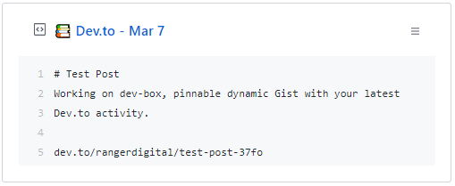

<p align="center">
  
  <h3 align="center">Dev-Box</h3>
  <p align="center">Pinnable dynamic Gist with your latest Dev.to post!</p>
</p>

***
[](https://www.gnu.org/licenses/gpl-3.0)

**Dev-Box** is a simple **GitHub Action** built to make dynamic Gist displaying your latest post from Dev.to

<br>

## 🎉 Usage
**To start, you need to prepare some things:**
- Create a new public GitHub Gist at https://gist.github.com/

- Create an Access Token with the `gist` scope and save it.
You can do that at https://github.com/settings/tokens/new

<br>

**After getting this done:**
- Fork this repository.

- Go to your fork's **Settings > Secrets** page add the following secrets:
	- **`DEVTO_USERNAME`** - Your username from Dev.to
	- **`GH_TOKEN`** - The access token you saved earlier.
	- **`GIST_ID`** - The ID of your newly created public Gist.

   *It will look like this:*  
	 `https://gist.github.com/RangerDigital/`**`d1b79f73d3e5a2420ed370b0059dba42`**.

 - Delete a `.github/workflows/schedule.yml` file.

 - Create a `.github/workflows/dev-box.yml` file like this:

 ```yml
 name: Update GitHub Gist with Dev-box!

 on:
   schedule:
     - cron: '*/10 * * * *'

 jobs:
   build:
     runs-on: ubuntu-latest

     steps:
       - uses: actions/checkout@master

       - name: Update latest post from Dev.to
         uses: rangerdigital/dev-box@master
         with:
           GH_TOKEN: ${{ secrets.GH_TOKEN }}
           GIST_ID: ${{ secrets.GIST_ID }}
           DEVTO_USERNAME: ${{ secrets.DEVTO_USERNAME }}
 ```

<br>

**That's It!**  
Now every 10 minutes `dev-box.yml` workflow will update your Gist.

<br>

## 🚧 Contributing

**You are more than welcome to help me improve Dev-Box!**

Just fork this project from the `master` branch and submit a Pull Request (PR).

<br>

## 📃 License
This project is licensed under [GPL-3.0](https://choosealicense.com/licenses/gpl-3.0/) .
